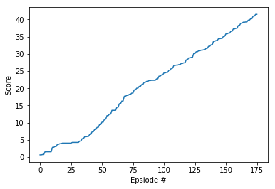

# Report about solving the Reacher environment

In this report, we will discuss the following:
* The learning algorithm
* The network architecture
* The reward plot

## Learning algorithm
In order to solve the tennis environment, we implemented the DDPG (Deep Deterministic Policy Gradient) algorithm.

DDPG is a model-free off-policy actor critic algorithm, that basically combines DQN and DPG. What DDPG brings to the table is being able to solve continuous actions spaces and to learn a deterministic policy, while using the actor-critic framework.
This policy-gradient algorithm uses two deep neural networks to learn the best policy for reward maximization and explore a stochastic environment.
DDPG is well-known for solving continuous spaces and the multi-agent here is used to improve coordination.

Basically, the Actor and Critic of each agent will work together to converge more quickly.

We also applied noise for an exploration policy and used the replay buffer for a better memorization.

### Hyperparameters:
The following hyperparameters have been used to train the model:
* BUFFER_SIZE = int(1e6)  # replay buffer size
* BATCH_SIZE = 64         # minibatch size
* GAMMA = 0.99            # discount factor
* TAU = 1e-3              # for soft update of target parameters
* LR_ACTOR = 1e-4         # learning rate of the actor
* LR_CRITIC = 3e-4        # learning rate of the critic
* WEIGHT_DECAY = 0.0001   # L2 weight decay

### Actor Network architecture:
For the actor network architecture, we decided to go with the following:
* First fully connected layer with input's size = state space size and output's size = 256
* Second fully connected layer with input's size = 256 and the output's size = action space size = 2

### Critic Network Architecture:
For the critic network architecture, we decided to go with the following:
* First fully connected layer with input's size = state space size and output's size = 256
* Second fully connected layer with input's size = 256 + action space size and the output's size = 256
* Third fully connected network with input's size = 256 and the output's size = 128
* Fourth fully connected network with input's size = 128 and the output's size = 1 to map states and actions to Q-values

## Reward plot:
It took 176 episodes to DDPG to solve the environment.
The following is the plot of the rewards

For more information, please refer to the following files:
* [model.py](training/model.py) to get the code for the network architecture
* [ddpg.py](agents/ddpg.py) to get the code for the agent's implementation
* [train.py](training/train.py) to get the code for training

## Improvement
I believe that I would be interested to verify if [SAC](https://arxiv.org/abs/1801.01290) (Soft Actor Critic) would give better results, due to the fact that it incorporates the entropy measure of the policy into the reward to encourage exploration. Or even D4PG, as it permits to make it run in a distributional fashion.